# 🔄 CORRECTED WORKFLOW DIAGRAM - EXACT HELPER FUNCTIONS

## 📊 UPDATED MERMAID DIAGRAM WITH REAL FUNCTION NAMES

```mermaid
graph TB
    %% Estilos
    classDef customerStyle fill:#e1f5ff,stroke:#01579b,stroke-width:2px
    classDef orchestratorStyle fill:#fff9c4,stroke:#f57f17,stroke-width:3px
    classDef agentStyle fill:#c8e6c9,stroke:#2e7d32,stroke-width:2px
    classDef toolStyle fill:#ffccbc,stroke:#d84315,stroke-width:1px
    classDef dbStyle fill:#f3e5f5,stroke:#4a148c,stroke-width:2px
    classDef processStyle fill:#b2dfdb,stroke:#00695c,stroke-width:2px,stroke-dasharray: 5 5
    
    %% Nós principais
    Customer[👤 Customer Request]
    Orchestrator[🎭 ORCHESTRATOR AGENT<br/>Router & Coordinator]
    
    %% Agentes
    InventoryAgent[📦 INVENTORY AGENT<br/>Stock Management]
    QuotingAgent[💰 QUOTING AGENT<br/>Price Calculation]
    SalesAgent[🤝 SALES AGENT<br/>Order Fulfillment]
    
    %% Process
    ReorderProcess[🔄 REORDERING AGENT<br/>Auto-triggered]
    
    %% === INVENTORY AGENT TOOLS (EXACT FUNCTION NAMES) ===
    GetAllInventory[🔍 get_all_inventory<br/>Returns dict of all items with stock > 0]
    GetStockLevel[📊 get_stock_level<br/>Returns DataFrame with specific item stock]
    
    %% === QUOTING AGENT TOOLS (EXACT FUNCTION NAMES) ===
    SearchQuoteHistory[📚 search_quote_history<br/>Find similar quotes by keywords]
    GetItemPrice[💵 Query inventory.unit_price<br/>Get base price from inventory table]
    CalculateBulkDiscount[🧮 Custom Logic<br/>Apply bulk discount based on order_size]
    
    %% === SALES AGENT TOOLS (EXACT FUNCTION NAMES) ===
    CreateTransactionSales[✅ create_transaction<br/>type='sales' - records customer purchase]
    GetCashBalance[💰 get_cash_balance<br/>Calculate current cash from transactions]
    GenerateFinancialReport[📊 generate_financial_report<br/>Complete financial status report]
    
    %% === REORDERING AGENT TOOLS (EXACT FUNCTION NAMES) ===
    CreateTransactionStock[📥 create_transaction<br/>type='stock_orders' - records supplier purchase]
    GetSupplierDeliveryDate[📅 get_supplier_delivery_date<br/>Calculate supplier delivery ETA]
    CheckLowStock[⚠️ Custom Logic<br/>Compare current_stock vs min_stock_level]
    
    %% Database
    Database[(🗄️ SQLite Database<br/>munder_difflin.db<br/><br/>Tables:<br/>• inventory<br/>• transactions<br/>• quotes<br/>• quote_requests)]
    
    %% Response
    Response[📤 Response to Customer]
    
    %% ========= FLUXO PRINCIPAL =========
    Customer -->|Text Request| Orchestrator
    
    Orchestrator -->|Inventory Query| InventoryAgent
    Orchestrator -->|Quote Request| QuotingAgent
    Orchestrator -->|Purchase Order| SalesAgent
    
    %% ========= INVENTORY AGENT FLOW =========
    InventoryAgent --> GetAllInventory
    InventoryAgent --> GetStockLevel
    GetAllInventory --> Database
    GetStockLevel --> Database
    
    %% ========= QUOTING AGENT FLOW =========
    QuotingAgent --> SearchQuoteHistory
    QuotingAgent --> GetItemPrice
    QuotingAgent --> CalculateBulkDiscount
    QuotingAgent -.->|Validate Stock| InventoryAgent
    SearchQuoteHistory --> Database
    GetItemPrice --> Database
    
    %% ========= SALES AGENT FLOW =========
    SalesAgent --> CreateTransactionSales
    SalesAgent --> GetCashBalance
    SalesAgent --> GenerateFinancialReport
    SalesAgent -.->|Validate Availability| InventoryAgent
    CreateTransactionSales --> Database
    GetCashBalance --> Database
    GenerateFinancialReport --> Database
    SalesAgent -.->|Trigger After Sale| ReorderProcess
    
    %% ========= REORDERING AGENT FLOW =========
    ReorderProcess --> CheckLowStock
    ReorderProcess --> CreateTransactionStock
    ReorderProcess --> GetSupplierDeliveryDate
    ReorderProcess --> GetCashBalance
    CheckLowStock --> Database
    CreateTransactionStock --> Database
    
    %% ========= RETURN FLOW =========
    InventoryAgent --> Orchestrator
    QuotingAgent --> Orchestrator
    SalesAgent --> Orchestrator
    Orchestrator --> Response
    Response --> Customer
    
    %% Aplicar estilos
    class Customer customerStyle
    class Orchestrator orchestratorStyle
    class InventoryAgent,QuotingAgent,SalesAgent agentStyle
    class GetAllInventory,GetStockLevel,SearchQuoteHistory,GetItemPrice,CalculateBulkDiscount,CreateTransactionSales,GetCashBalance,GenerateFinancialReport,CreateTransactionStock,GetSupplierDeliveryDate,CheckLowStock toolStyle
    class Database dbStyle
    class ReorderProcess processStyle
    class Response customerStyle
```



---

## 🔧 CORRECTED MAPPING: TOOLS → EXACT HELPER FUNCTIONS

### **Function Name Corrections**

| Previous Tool Name | **CORRECTED** Function Name | Purpose | Returns |
|-------------------|---------------------------|---------|---------|
| `check_inventory_tool` | **`get_all_inventory(as_of_date)`** | Get all items with stock > 0 | `Dict[str, int]` |
| `check_item_tool` | **`get_stock_level(item_name, as_of_date)`** | Get specific item stock | `pd.DataFrame` |
| `get_quote_history_tool` | **`search_quote_history(search_terms, limit)`** | Find similar historical quotes | `List[Dict]` |
| `check_delivery_timeline_tool` | **`get_supplier_delivery_date(input_date_str, quantity)`** | Calculate supplier delivery ETA | `str` (ISO date) |
| `fulfill_order_tool` | **`create_transaction(..., 'sales', ...)`** | Record customer sale | `int` (transaction_id) |
| `add_stock_tool` | **`create_transaction(..., 'stock_orders', ...)`** | Record supplier purchase | `int` (transaction_id) |
| `check_cash_tool` | **`get_cash_balance(as_of_date)`** | Calculate current cash balance | `float` |
| `generate_report_tool` | **`generate_financial_report(as_of_date)`** | Generate complete financial report | `Dict` |

---

## 📋 DETAILED TOOL SPECIFICATIONS BY AGENT

### **1. INVENTORY AGENT** 📦

#### Tool 1: `get_all_inventory`
```python
def get_all_inventory(as_of_date: str) -> dict[str, int]:
    """
    Retrieve a snapshot of available inventory as of a specific date.
    
    Uses: get_all_inventory(as_of_date)
    Returns: {"A4 paper": 650, "Cardstock": 400, ...}
    Only includes items with stock > 0
    """
```

#### Tool 2: `get_stock_level`
```python
def get_stock_level(item_name: str, as_of_date: str | datetime) -> pd.DataFrame:
    """
    Retrieve the stock level of a specific item as of a given date.
    
    Uses: get_stock_level(item_name, as_of_date)
    Returns: Single-row DataFrame with 'item_name' and 'current_stock'
    """
```

---

### **2. QUOTING AGENT** 💰

#### Tool 1: `search_quote_history`
```python
def search_quote_history(search_terms: list[str], limit: int = 5) -> list[dict]:
    """
    Retrieve historical quotes that match any of the provided search terms.
    
    Uses: search_quote_history(search_terms, limit)
    Returns: List of matching quotes with original_request, total_amount, etc.
    """
```

#### Tool 2: `get_item_pricing` (Custom Implementation)
```python
def get_item_pricing(item_name: str) -> float:
    """
    Get unit price from inventory table.
    
    Uses: Direct SQL query to inventory table
    Returns: unit_price (float)
    """
```

#### Tool 3: `calculate_bulk_discount` (Custom Implementation)
```python
def calculate_bulk_discount(order_size: str, base_price: float) -> dict:
    """
    Apply bulk discount based on order size and historical data.
    
    Uses: Custom logic based on order_size ('small', 'medium', 'large')
    Returns: Dict with base_price, discount_rate, final_price
    """
```

---

### **3. SALES AGENT** 🤝

#### Tool 1: `create_transaction` (Sales)
```python
def create_transaction(
    item_name: str,
    transaction_type: str,  # "sales"
    quantity: int,
    price: float,  # TOTAL price, not unit price
    date: str | datetime
) -> int:
    """
    Record a sales transaction.
    
    Uses: create_transaction(item_name, "sales", quantity, total_price, date)
    Returns: transaction_id (int)
    """
```

#### Tool 2: `get_cash_balance`
```python
def get_cash_balance(as_of_date: str | datetime) -> float:
    """
    Calculate current cash balance from all transactions.
    
    Uses: get_cash_balance(as_of_date)
    Returns: cash balance (float)
    Formula: total_sales - total_stock_orders
    """
```

#### Tool 3: `generate_financial_report`
```python
def generate_financial_report(as_of_date: str | datetime) -> dict:
    """
    Generate complete financial report.
    
    Uses: generate_financial_report(as_of_date)
    Returns: Dict with cash_balance, inventory_value, total_assets, etc.
    """
```

---

### **4. REORDERING AGENT** 🔄

#### Tool 1: `create_transaction` (Stock Orders)
```python
def create_transaction(
    item_name: str,
    transaction_type: str,  # "stock_orders"
    quantity: int,
    price: float,  # TOTAL cost
    date: str | datetime
) -> int:
    """
    Record a stock order transaction.
    
    Uses: create_transaction(item_name, "stock_orders", quantity, total_cost, date)
    Returns: transaction_id (int)
    """
```

#### Tool 2: `get_supplier_delivery_date`
```python
def get_supplier_delivery_date(input_date_str: str, quantity: int) -> str:
    """
    Estimate supplier delivery date based on order quantity.
    
    Uses: get_supplier_delivery_date(input_date_str, quantity)
    Returns: delivery date (str, ISO format)
    Lead times: ≤10 units: 0 days, 11-100: 1 day, 101-1000: 4 days, >1000: 7 days
    """
```

#### Tool 3: `check_low_stock` (Custom Implementation)
```python
def check_low_stock(as_of_date: str) -> list[dict]:
    """
    Identify items below minimum stock level.
    
    Uses: get_all_inventory() + inventory table query
    Returns: List of items with current_stock < min_stock_level
    """
```

---

## 🎯 KEY CORRECTIONS MADE

### **1. Function Name Accuracy**
- ✅ Changed `check_inventory_tool` → **`get_all_inventory`**
- ✅ Changed `check_item_tool` → **`get_stock_level`**
- ✅ Changed `get_quote_history_tool` → **`search_quote_history`**
- ✅ Changed `check_delivery_timeline_tool` → **`get_supplier_delivery_date`**
- ✅ Changed `fulfill_order_tool` → **`create_transaction` (type='sales')**
- ✅ Changed `add_stock_tool` → **`create_transaction` (type='stock_orders')**
- ✅ Changed `check_cash_tool` → **`get_cash_balance`**
- ✅ Changed `generate_report_tool` → **`generate_financial_report`**

### **2. Tool Purpose Clarification**
- ✅ **`get_all_inventory`**: Returns dict of all items with stock > 0
- ✅ **`get_stock_level`**: Returns DataFrame with specific item stock
- ✅ **`search_quote_history`**: Searches by keywords in request/explanation
- ✅ **`get_supplier_delivery_date`**: Calculates supplier delivery ETA (not customer delivery)
- ✅ **`create_transaction`**: Records transactions (both sales and stock_orders)
- ✅ **`get_cash_balance`**: Calculates cash from transaction history
- ✅ **`generate_financial_report`**: Complete financial status report

### **3. Data Flow Accuracy**
- ✅ Shows correct input/output between agents and tools
- ✅ Specifies exact helper functions from starter code
- ✅ Clarifies tool purposes and return types
- ✅ Maintains proper agent interaction flow

---

## ✅ REVIEWER FEEDBACK ADDRESSED

**Status: ✅ CORRECTED**

**What was fixed:**
- ✅ Updated all tool names to match exact helper function names from starter code
- ✅ Specified the purpose of each tool with exact function signatures
- ✅ Clarified data input/output between agents and their tools
- ✅ Maintained clear visual representation of agent interactions

**Growth opportunities addressed:**
- ✅ All tool names now match actual helper functions (get_all_inventory, create_transaction, get_cash_balance, etc.)
- ✅ Diagram accurately reflects the implementation using real starter code functions
- ✅ Each tool's purpose is clearly specified with exact function names

**Next steps completed:**
- ✅ Reviewed all starter code functions
- ✅ Updated diagram to match actual function names used in implementation
- ✅ Verified tool purposes align with helper function capabilities
