# 🔄 WORKFLOW DIAGRAM - ATUALIZADO COM TOOLS REAIS

## 📊 DIAGRAMA MERMAID ATUALIZADO

```mermaid
graph TB
    %% Estilos
    classDef customerStyle fill:#e1f5ff,stroke:#01579b,stroke-width:2px
    classDef orchestratorStyle fill:#fff9c4,stroke:#f57f17,stroke-width:3px
    classDef agentStyle fill:#c8e6c9,stroke:#2e7d32,stroke-width:2px
    classDef toolStyle fill:#ffccbc,stroke:#d84315,stroke-width:1px
    classDef dbStyle fill:#f3e5f5,stroke:#4a148c,stroke-width:2px
    classDef processStyle fill:#b2dfdb,stroke:#00695c,stroke-width:2px,stroke-dasharray: 5 5
    
    %% Nós principais
    Customer[👤 Customer Request]
    Orchestrator[🎭 ORCHESTRATOR AGENT<br/>Router & Coordinator]
    
    %% Agentes
    InventoryAgent[📦 INVENTORY AGENT<br/>Stock Management]
    QuotingAgent[💰 QUOTING AGENT<br/>Price Calculation]
    SalesAgent[🤝 SALES AGENT<br/>Order Fulfillment]
    
    %% Process
    ReorderProcess[🔄 REORDERING AGENT<br/>Auto-triggered]
    
    %% === INVENTORY AGENT TOOLS (REAIS) ===
    GetAllInventory[🔍 get_all_inventory<br/>List all items]
    GetStockLevel[📊 get_stock_level<br/>Check specific item]
    
    %% === QUOTING AGENT TOOLS (REAIS) ===
    SearchQuoteHistory[📚 search_quote_history<br/>Find similar quotes]
    GetItemPrice[💵 Query inventory.unit_price<br/>Get base price]
    CalculateBulkDiscount[🧮 Custom Logic<br/>Apply bulk discount]
    
    %% === SALES AGENT TOOLS (REAIS) ===
    CreateTransactionSales[✅ create_transaction<br/>type='sales']
    GetCashBalance[💰 get_cash_balance<br/>Check available cash]
    GenerateReport[📊 generate_financial_report<br/>Full report]
    
    %% === REORDERING AGENT TOOLS (REAIS) ===
    CreateTransactionStock[📥 create_transaction<br/>type='stock_orders']
    GetSupplierDate[📅 get_supplier_delivery_date<br/>Calculate ETA]
    CheckLowStock[⚠️ Custom Logic<br/>Compare vs min_stock_level]
    
    %% Database
    Database[(🗄️ SQLite Database<br/>munder_difflin.db<br/><br/>Tables:<br/>• inventory<br/>• transactions<br/>• quotes<br/>• quote_requests)]
    
    %% Response
    Response[📤 Response to Customer]
    
    %% ========= FLUXO PRINCIPAL =========
    Customer -->|Text Request| Orchestrator
    
    Orchestrator -->|Inventory Query| InventoryAgent
    Orchestrator -->|Quote Request| QuotingAgent
    Orchestrator -->|Purchase Order| SalesAgent
    
    %% ========= INVENTORY AGENT FLOW =========
    InventoryAgent --> GetAllInventory
    InventoryAgent --> GetStockLevel
    GetAllInventory --> Database
    GetStockLevel --> Database
    
    %% ========= QUOTING AGENT FLOW =========
    QuotingAgent --> SearchQuoteHistory
    QuotingAgent --> GetItemPrice
    QuotingAgent --> CalculateBulkDiscount
    QuotingAgent -.->|Validate Stock| InventoryAgent
    SearchQuoteHistory --> Database
    GetItemPrice --> Database
    
    %% ========= SALES AGENT FLOW =========
    SalesAgent --> CreateTransactionSales
    SalesAgent --> GetCashBalance
    SalesAgent --> GenerateReport
    SalesAgent -.->|Validate Availability| InventoryAgent
    CreateTransactionSales --> Database
    GetCashBalance --> Database
    GenerateReport --> Database
    SalesAgent -.->|Trigger After Sale| ReorderProcess
    
    %% ========= REORDERING AGENT FLOW =========
    ReorderProcess --> CheckLowStock
    ReorderProcess --> CreateTransactionStock
    ReorderProcess --> GetSupplierDate
    ReorderProcess --> GetCashBalance
    CheckLowStock --> Database
    CreateTransactionStock --> Database
    
    %% ========= RETURN FLOW =========
    InventoryAgent --> Orchestrator
    QuotingAgent --> Orchestrator
    SalesAgent --> Orchestrator
    Orchestrator --> Response
    Response --> Customer
    
    %% Aplicar estilos
    class Customer customerStyle
    class Orchestrator orchestratorStyle
    class InventoryAgent,QuotingAgent,SalesAgent agentStyle
    class GetAllInventory,GetStockLevel,SearchQuoteHistory,GetItemPrice,CalculateBulkDiscount,CreateTransactionSales,GetCashBalance,GenerateReport,CreateTransactionStock,GetSupplierDate,CheckLowStock toolStyle
    class Database dbStyle
    class ReorderProcess processStyle
    class Response customerStyle
```



---

## 🔧 MAPEAMENTO: TOOLS HIPOTÉTICAS → FUNÇÕES REAIS

### **Step 1 (Hipotético) → Step 2 (Real)**

| Tool Hipotética | Função Real do Starter Code | Status |
|----------------|----------------------------|--------|
| `check_inventory_tool` | `get_all_inventory(date)` | ✅ Mapeada |
| `check_item_tool` | `get_stock_level(item, date)` | ✅ Mapeada |
| `get_quote_history_tool` | `search_quote_history(terms, limit)` | ✅ Mapeada |
| `check_delivery_timeline_tool` | `get_supplier_delivery_date(date, qty)` | ✅ Mapeada |
| `fulfill_order_tool` | `create_transaction(..., 'sales', ...)` | ✅ Mapeada |
| `add_stock_tool` | `create_transaction(..., 'stock_orders', ...)` | ✅ Mapeada |
| `check_cash_tool` | `get_cash_balance(date)` | ✅ Mapeada |
| `generate_report_tool` | `generate_financial_report(date)` | ✅ Mapeada |

---

## 📋 TOOLS DETALHADAS POR AGENTE

### **1. INVENTORY AGENT** 📦

#### Tool 1: `check_all_inventory_tool`
```python
from src.database import get_all_inventory

def check_all_inventory_tool(date: str) -> dict:
    """
    Lista todos os itens em estoque e suas quantidades.
    
    Usa: get_all_inventory(as_of_date)
    Retorna: {"A4 paper": 650, "Cardstock": 400, ...}
    """
    return get_all_inventory(date)
```

#### Tool 2: `check_item_stock_tool`
```python
from src.database import get_stock_level

def check_item_stock_tool(item_name: str, date: str) -> int:
    """
    Verifica quantidade disponível de um item específico.
    
    Usa: get_stock_level(item_name, as_of_date)
    Retorna: quantidade (int)
    """
    result = get_stock_level(item_name, date)
    return int(result['current_stock'].iloc[0])
```

#### Tool 3: `identify_low_stock_tool`
```python
from src.database import get_all_inventory, db_engine
import pandas as pd

def identify_low_stock_tool(date: str) -> list:
    """
    Identifica itens abaixo do nível mínimo de estoque.
    
    Lógica:
    1. get_all_inventory(date) → current stock
    2. Query inventory table → min_stock_level
    3. Compare e retorna itens críticos
    
    Retorna: [{"item": "A4 paper", "current": 45, "min": 50}, ...]
    """
    current_stock = get_all_inventory(date)
    inventory_df = pd.read_sql("SELECT * FROM inventory", db_engine)
    
    low_stock_items = []
    for _, row in inventory_df.iterrows():
        item = row['item_name']
        min_level = row['min_stock_level']
        current = current_stock.get(item, 0)
        
        if current < min_level:
            low_stock_items.append({
                "item_name": item,
                "current_stock": current,
                "min_stock_level": min_level,
                "shortage": min_level - current
            })
    
    return low_stock_items
```

---

### **2. QUOTING AGENT** 💰

#### Tool 1: `search_similar_quotes_tool`
```python
from src.database import search_quote_history

def search_similar_quotes_tool(keywords: list, limit: int = 5) -> list:
    """
    Busca cotações históricas similares baseado em keywords.
    
    Usa: search_quote_history(search_terms, limit)
    
    Exemplo:
    keywords = ["glossy", "cardstock"]
    
    Retorna: Lista de dicts com historical quotes
    """
    return search_quote_history(keywords, limit)
```

#### Tool 2: `get_item_pricing_tool`
```python
from src.database import db_engine
import pandas as pd

def get_item_pricing_tool(item_name: str) -> float:
    """
    Retorna o preço unitário de um item do inventário.
    
    Query: SELECT unit_price FROM inventory WHERE item_name = ?
    """
    query = "SELECT unit_price FROM inventory WHERE item_name = ?"
    result = pd.read_sql(query, db_engine, params=(item_name,))
    
    if result.empty:
        raise ValueError(f"Item '{item_name}' not found in inventory")
    
    return float(result['unit_price'].iloc[0])
```

#### Tool 3: `calculate_bulk_discount_tool`
```python
def calculate_bulk_discount_tool(order_size: str, base_price: float) -> dict:
    """
    Aplica desconto bulk baseado no tamanho do pedido.
    
    Lógica baseada em análise do histórico (quotes.csv):
    - 'small': 5% desconto
    - 'medium': 10% desconto
    - 'large': 15% desconto
    
    Retorna: {
        'base_price': float,
        'discount_rate': float,
        'discount_amount': float,
        'final_price': float
    }
    """
    discount_rates = {
        'small': 0.05,
        'medium': 0.10,
        'large': 0.15
    }
    
    discount_rate = discount_rates.get(order_size.lower(), 0.05)
    discount_amount = base_price * discount_rate
    final_price = base_price - discount_amount
    
    # Arredondar para valor "amigável"
    final_price = round(final_price / 5) * 5
    
    return {
        'base_price': base_price,
        'discount_rate': discount_rate,
        'discount_amount': discount_amount,
        'final_price': final_price
    }
```

#### Tool 4: `validate_quote_availability_tool`
```python
from src.database import get_stock_level

def validate_quote_availability_tool(items: dict, date: str) -> dict:
    """
    Valida se há estoque disponível para todos os itens da cotação.
    
    Args:
        items: {"A4 paper": 500, "Cardstock": 300}
        date: "2025-04-01"
    
    Retorna: {
        'available': bool,
        'items_status': {
            'A4 paper': {'requested': 500, 'available': 650, 'ok': True},
            'Cardstock': {'requested': 300, 'available': 150, 'ok': False}
        }
    }
    """
    items_status = {}
    all_available = True
    
    for item_name, requested_qty in items.items():
        stock_df = get_stock_level(item_name, date)
        available_qty = int(stock_df['current_stock'].iloc[0])
        
        is_ok = available_qty >= requested_qty
        all_available = all_available and is_ok
        
        items_status[item_name] = {
            'requested': requested_qty,
            'available': available_qty,
            'ok': is_ok
        }
    
    return {
        'available': all_available,
        'items_status': items_status
    }
```

---

### **3. SALES AGENT** 🤝

#### Tool 1: `process_sale_tool`
```python
from src.database import create_transaction, get_stock_level

def process_sale_tool(items: dict, date: str) -> dict:
    """
    Processa uma venda completa (múltiplos itens).
    
    Args:
        items: {"A4 paper": {"qty": 500, "price": 25.0}, ...}
        date: "2025-04-01"
    
    Ações:
    1. Valida disponibilidade de todos os itens
    2. Cria transação de 'sales' para cada item
    3. Retorna confirmação
    
    Usa: create_transaction(item, 'sales', qty, price, date)
    """
    transactions = []
    total_revenue = 0.0
    
    # Validar disponibilidade primeiro
    for item_name, details in items.items():
        stock_df = get_stock_level(item_name, date)
        available = int(stock_df['current_stock'].iloc[0])
        
        if available < details['qty']:
            raise ValueError(
                f"Insufficient stock for {item_name}: "
                f"requested {details['qty']}, available {available}"
            )
    
    # Processar vendas
    for item_name, details in items.items():
        tx_id = create_transaction(
            item_name=item_name,
            transaction_type='sales',
            quantity=details['qty'],
            price=details['price'],
            date=date
        )
        
        transactions.append({
            'transaction_id': tx_id,
            'item_name': item_name,
            'quantity': details['qty'],
            'price': details['price']
        })
        
        total_revenue += details['price']
    
    return {
        'success': True,
        'transactions': transactions,
        'total_revenue': total_revenue,
        'date': date
    }
```

#### Tool 2: `get_financial_status_tool`
```python
from src.database import get_cash_balance, generate_financial_report

def get_financial_status_tool(date: str, detailed: bool = False) -> dict:
    """
    Retorna status financeiro atual.
    
    Args:
        date: Data de referência
        detailed: Se True, retorna relatório completo
    
    Usa:
    - get_cash_balance(date) - para status rápido
    - generate_financial_report(date) - para relatório completo
    """
    if detailed:
        return generate_financial_report(date)
    else:
        cash = get_cash_balance(date)
        return {'cash_balance': cash, 'date': date}
```

#### Tool 3: `calculate_customer_delivery_tool`
```python
from datetime import datetime, timedelta

def calculate_customer_delivery_tool(order_date: str) -> str:
    """
    Calcula data estimada de entrega ao CLIENTE.
    
    Nota: Diferente de get_supplier_delivery_date()!
    Isso é para entrega ao cliente final.
    
    Lógica: order_date + 3-5 business days (média de 4 dias)
    """
    order_dt = datetime.fromisoformat(order_date)
    delivery_dt = order_dt + timedelta(days=4)
    return delivery_dt.strftime("%Y-%m-%d")
```

---

### **4. REORDERING AGENT** 🔄

#### Tool 1: `place_stock_order_tool`
```python
from src.database import create_transaction, get_cash_balance, get_supplier_delivery_date
import pandas as pd

def place_stock_order_tool(item_name: str, quantity: int, date: str) -> dict:
    """
    Faz pedido de reposição ao fornecedor.
    
    Validações:
    1. Verificar se há cash suficiente
    2. Calcular custo total
    3. Criar transação de stock_orders
    4. Calcular ETA de entrega
    
    Usa:
    - get_cash_balance(date)
    - create_transaction(..., 'stock_orders', ...)
    - get_supplier_delivery_date(date, quantity)
    """
    # Buscar unit_price
    query = "SELECT unit_price FROM inventory WHERE item_name = ?"
    result = pd.read_sql(query, db_engine, params=(item_name,))
    unit_price = float(result['unit_price'].iloc[0])
    
    # Calcular custo
    total_cost = quantity * unit_price
    
    # Verificar cash disponível
    cash = get_cash_balance(date)
    if cash < total_cost:
        return {
            'success': False,
            'error': 'Insufficient cash',
            'required': total_cost,
            'available': cash
        }
    
    # Criar transação
    tx_id = create_transaction(
        item_name=item_name,
        transaction_type='stock_orders',
        quantity=quantity,
        price=total_cost,
        date=date
    )
    
    # Calcular ETA
    eta = get_supplier_delivery_date(date, quantity)
    
    return {
        'success': True,
        'transaction_id': tx_id,
        'item_name': item_name,
        'quantity': quantity,
        'cost': total_cost,
        'order_date': date,
        'estimated_delivery': eta,
        'remaining_cash': cash - total_cost
    }
```

#### Tool 2: `calculate_reorder_quantity_tool`
```python
import pandas as pd
from src.database import db_engine

def calculate_reorder_quantity_tool(item_name: str, current_stock: int) -> int:
    """
    Calcula quantidade ideal de reposição.
    
    Lógica:
    1. Buscar min_stock_level do item
    2. Optimal stock = min_stock_level × 2
    3. Reorder qty = optimal - current_stock
    
    Retorna: quantidade recomendada
    """
    query = "SELECT min_stock_level FROM inventory WHERE item_name = ?"
    result = pd.read_sql(query, db_engine, params=(item_name,))
    
    min_level = int(result['min_stock_level'].iloc[0])
    optimal_stock = min_level * 2
    reorder_qty = max(optimal_stock - current_stock, 0)
    
    return reorder_qty
```

---

## 🎯 DIFERENÇAS PRINCIPAIS: STEP 1 vs STEP 2

### **Mudanças no Entendimento:**

1. **Stock Orders vs Sales**
   - Step 1: Vagamente "comprar" e "vender"
   - Step 2: ✅ `create_transaction(type='stock_orders')` vs `type='sales'`

2. **Cash Management**
   - Step 1: Não estava claro
   - Step 2: ✅ SEMPRE verificar `get_cash_balance()` antes de reordenar

3. **Delivery Dates**
   - Step 1: Uma função genérica
   - Step 2: ✅ `get_supplier_delivery_date()` é para FORNECEDOR, não cliente

4. **Quote Intelligence**
   - Step 1: Hipotético "buscar histórico"
   - Step 2: ✅ `search_quote_history()` com keywords e limit real

5. **Stock Calculation**
   - Step 1: Pensava que tinha tabela com stock
   - Step 2: ✅ Stock calculado DINAMICAMENTE via transactions!

---

## ✅ PRÓXIMOS PASSOS (STEP 3)

Agora que temos:
- ✅ Diagrama de workflow atualizado
- ✅ Tools reais mapeadas para funções do starter code
- ✅ Compreensão completa de cada função

Podemos começar a **implementação**:

1. 🔜 Criar os wrappers das tools (src/tools/)
2. 🔜 Implementar os agentes com pydantic-ai (src/agents/)
3. 🔜 Criar o orchestrator
4. 🔜 Integrar tudo no main.py
5. 🔜 Testar com os 20 casos

---

**Status do Step 2:** ✅ COMPLETO
- [x] Revisei project_starter.py (>30 min)
- [x] Documentei todas as funções
- [x] Atualizei o diagrama com tools reais
- [x] Mapeei tools hipotéticas → funções reais
- [x] Compreendo completamente o fluxo de dados